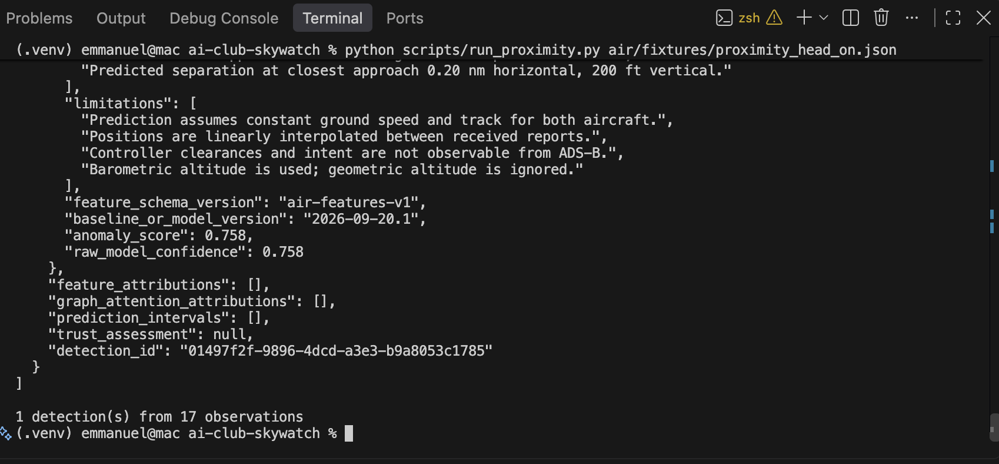

# detect_observations

**Author:** Manni · **PR:** #17 · **File:** `air/detectors/proximity/detector.py`

## What it does

Takes raw ADS-B observations and runs time alignment, candidate selection, geometry calculation, and proximity rules in order. It returns one Detection per qualifying aircraft pair across the supplied observations, keeping the instant with the smallest predicted horizontal separation. This connects the individual stages to the existing SENTINEL output contract.

## Inputs and outputs

| | Type | Units | Notes |
|---|---|---|---|
| in | `list[AdsbObservation]` | Positions in degrees, altitude in ft, speed in kt, track in degrees, vertical rate in ft/min; observation timestamps | Raw observations for multiple aircraft; alignment groups and sorts their tracks. |
| configuration | `ProximityConfig` via `self.config` | Grid and lookahead in seconds; separation thresholds in nm and ft | The same configuration is passed to alignment, candidate selection, rules, and output conversion. |
| out | `list[Detection]` | Evidence includes predicted separation in nm and ft and time to closest approach in seconds | One result per qualifying aircraft pair, or an empty list if none qualify. |

## How it works

1. Call `align_tracks` to put aircraft observations onto common grid timestamps.
2. At each timestamp, call `candidate_pairs` to select pairs that survive the inexpensive filters.
3. Call `pair_geometry` for each candidate, skipping missing geometry, then call `flag_pair`, skipping results with no severity.
4. Store geometry and severity together in a dictionary keyed by the two aircraft IDs. Replace an existing entry only when the new predicted horizontal separation is smaller.
5. Convert the retained entries with `to_detection`, preserving their evidence, severity, provenance, and explanation facts.

## Decisions and trade-offs

- Deduplication uses aircraft IDs, not timestamps, so repeated observations of the same pair produce a single alert per invocation. `candidate_pairs` supplies IDs in a consistent order.
- Selection compares predicted horizontal separation, not current distance, time to closest approach, or severity. The retained severity belongs to the retained geometry.
- Equal predicted horizontal separations keep the first qualifying instant encountered. Alignment supplies timestamps in chronological order.
- Thresholds and geometry remain in their existing stages; this function only coordinates them. An unfinished stage raises its error rather than being treated as a benign encounter.

## What it does NOT handle

This function does not split separate encounters involving the same pair within one input batch, or deduplicate alerts across separate calls. It inherits the pipeline's constant-motion prediction and interpolation limits; controller clearances and intent are not observable from ADS-B, and the output uses barometric altitude rather than geometric altitude. It does not implement the rule thresholds or replace missing upstream implementations.

## Tests

`tests/air/detectors/proximity/test_proximity_detector.py` — 9 test cases across 5 test functions, including a function parametrized over 5 fixtures.

The fixtures cover head-on and crossing encounters plus benign diverging, vertically stacked, and ground cases. Additional checks cover one alert per encounter, two aircraft in the Detection contract, serialization and provenance, factual explanations, and the planted head-on geometry.

All five `@todo("Paul")` decorators have been removed. The rule implementation is supplied by the companion PR #22 (`proximity/calebg/rules`). The focused detector and rules run reports **28 passed**; the full suite reports **118 passed**, with no expected failures.

The head-on fixture command (`python scripts/run_proximity.py air/fixtures/proximity_head_on.json`) completes successfully: **1 detection from 17 observations**, severity HIGH, predicted horizontal separation approximately **0.20 nm**, predicted vertical separation **200 ft**, and time to closest approach approximately **58 seconds**. These results were verified with the companion rules branch included.

## Fixture output screenshot

